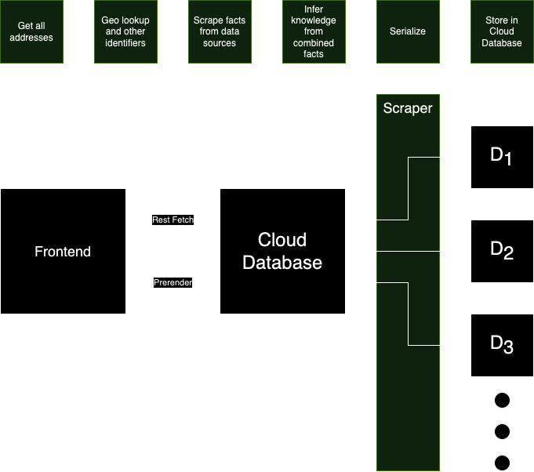

# Homepage van je Huis

> Take a look at the past, present and future of your home!

## Design



### Requirements

- The only input users provide is their zip-code and street number
- The amount of data sources must scale easily
    - Adding a connector must be quick and easy
    - Provide extendable interfaces to quickly hook into the existing setup
- Serve content as quickly possible
    - Any mapping to geolocation/neighbourhoods should have pre-calculated
    - Don't make queries to external data sources at run-time

### Decisions

- SvelteKit. It's what I (Isha) am most comfortable with.
  As this POC is mostly about the "backend", it should be easily replaceable by your favourite flavour of frontend
- Scrape data beforehand and store it into our own database format. This way we won't have to make any external queries
  per user
- Use a cloud-hosted database provider which the frontend can hook into (type-safely).
  This way we won't need a "traditional" backend, and no caching!
    - \[Undecided\] RDBMS vs Document store. My preference is relational as I suspect a gigantic amount of duplicated
      data.
      It also provides the guarantee that not everything might break at build-time.
      But it might incur a performance hit compared to a Document store
- \[Undecided\] Should we statically prerender all pages? This would make the site completely static and incredibly
  fast,
  with the trade-off that the build/deploy process might take a while, and we have to store a ton of duplicated data
- \[Undecided\] How to deal with updated entries from data sources, overwrite everything or check for diffs?

## Frontend Development

### Install dependencies

```bash
npm install
```

### Start the dev server

```bash
npm run dev
```

### Building a production application

```bash
npm run build
```
